# Deep Learning: Build a Traffic Sign Recognition Classifier

***
This is the markdown version of the jupyter notebook code for the traffic sign classifier. For details about the project and a report explaining the results, please see README.md

***

## Step 0: Load The Data


```python
# Load pickled data
import pickle
training_file = 'traffic-signs-data/train.p'
validation_file= 'traffic-signs-data/valid.p'
testing_file = 'traffic-signs-data/test.p'
with open(training_file, mode='rb') as f:
    train = pickle.load(f)
with open(validation_file, mode='rb') as f:
    valid = pickle.load(f)
with open(testing_file, mode='rb') as f:
    test = pickle.load(f)
X_train, y_train = train['features'], train['labels']
X_valid, y_valid = valid['features'], valid['labels']
X_test, y_test = test['features'], test['labels']
print("Data Loaded")
```

    Data Loaded


---

## Step 1: Dataset Summary & Exploration

The pickled data is a dictionary with 4 key/value pairs:

- `'features'` is a 4D array containing raw pixel data of the traffic sign images, (num examples, width, height, channels).
- `'labels'` is a 1D array containing the label/class id of the traffic sign. The file `signnames.csv` contains id -> name mappings for each id.
- `'sizes'` is a list containing tuples, (width, height) representing the the original width and height the image.
- `'coords'` is a list containing tuples, (x1, y1, x2, y2) representing coordinates of a bounding box around the sign in the image. **THESE COORDINATES ASSUME THE ORIGINAL IMAGE. THE PICKLED DATA CONTAINS RESIZED VERSIONS (32 by 32) OF THESE IMAGES**

Complete the basic data summary below. Use python, numpy and/or pandas methods to calculate the data summary rather than hard coding the results. For example, the [pandas shape method](http://pandas.pydata.org/pandas-docs/stable/generated/pandas.DataFrame.shape.html) might be useful for calculating some of the summary results. 

### Provide a Basic Summary of the Data Set Using Python, Numpy and/or Pandas


```python
# Number of training examples
n_train = len(X_train)

# Number of testing examples.
n_test = len(X_test)

# What's the shape of an traffic sign image?
image_shape = (len(X_train[0]),len(X_train[0][0]), len(X_train[0][0][0]))

# How many unique classes/labels there are in the dataset.
n_classes = len(set(train['labels']))

print("Number of training examples =", n_train)
print("Number of testing examples =", n_test)
print("Image data shape =", image_shape)
print("Number of classes =", n_classes)
```

    Number of training examples = 34799
    Number of testing examples = 12630
    Image data shape = (32, 32, 3)
    Number of classes = 43


### Include an exploratory visualization of the dataset

Visualize the German Traffic Signs Dataset using the pickled file(s). This is open ended, suggestions include: plotting traffic sign images, plotting the count of each sign, etc.

The [Matplotlib](http://matplotlib.org/) [examples](http://matplotlib.org/examples/index.html) and [gallery](http://matplotlib.org/gallery.html) pages are a great resource for doing visualizations in Python.

**NOTE:** It's recommended you start with something simple first. If you wish to do more, come back to it after you've completed the rest of the sections.


```python
import matplotlib.pyplot as plt
%matplotlib inline
import numpy as np
import pandas
import csv
import random

#Load the labels for classes
reader = csv.reader(open("signnames.csv"))
next(reader, None)  # skip the headers
class_labels=[]
for row in reader:
    class_labels.append(row[1:])

#Show table of frequencies and histogram of classes
data = train['labels']
classes = pandas.Series(data)
counts = classes.value_counts()

print('Label Index [Label Text] => Image Index')
print()
for index, val in counts.iteritems():
    print(index, class_labels[index], "=>", val)

print()
print("Histogram with frquency per label index")
print()
plt.hist(data, bins=np.arange(data.min(), data.max()+1))
plt.show()

#show samples of the 5 most frequent signs
samples = []
samples.append(data.tolist().index(2)) 
samples.append(data.tolist().index(1))
samples.append(data.tolist().index(13))
samples.append(data.tolist().index(12))
samples.append(data.tolist().index(38))

print()
print("Most common images")
print()
for index in samples:
    image = X_train[index].squeeze()
    plt.figure(figsize=(1,1))
    plt.imshow(image, cmap="gray")
    plt.show()
    print("Image Index:",index, " Label Index:", y_train[index], " Class:", class_labels[y_train[index]])


```

    Label Index [Label Text] => Image Index
    
    2 ['Speed limit (50km/h)'] => 2010
    1 ['Speed limit (30km/h)'] => 1980
    13 ['Yield'] => 1920
    12 ['Priority road'] => 1890
    38 ['Keep right'] => 1860
    10 ['No passing for vehicles over 3.5 metric tons'] => 1800
    4 ['Speed limit (70km/h)'] => 1770
    5 ['Speed limit (80km/h)'] => 1650
    25 ['Road work'] => 1350
    9 ['No passing'] => 1320
    7 ['Speed limit (100km/h)'] => 1290
    8 ['Speed limit (120km/h)'] => 1260
    3 ['Speed limit (60km/h)'] => 1260
    11 ['Right-of-way at the next intersection'] => 1170
    18 ['General caution'] => 1080
    35 ['Ahead only'] => 1080
    17 ['No entry'] => 990
    31 ['Wild animals crossing'] => 690
    14 ['Stop'] => 690
    33 ['Turn right ahead'] => 599
    15 ['No vehicles'] => 540
    26 ['Traffic signals'] => 540
    28 ['Children crossing'] => 480
    23 ['Slippery road'] => 450
    30 ['Beware of ice/snow'] => 390
    34 ['Turn left ahead'] => 360
    6 ['End of speed limit (80km/h)'] => 360
    16 ['Vehicles over 3.5 metric tons prohibited'] => 360
    22 ['Bumpy road'] => 330
    36 ['Go straight or right'] => 330
    40 ['Roundabout mandatory'] => 300
    20 ['Dangerous curve to the right'] => 300
    21 ['Double curve'] => 270
    39 ['Keep left'] => 270
    24 ['Road narrows on the right'] => 240
    29 ['Bicycles crossing'] => 240
    32 ['End of all speed and passing limits'] => 210
    42 ['End of no passing by vehicles over 3.5 metric tons'] => 210
    41 ['End of no passing'] => 210
    27 ['Pedestrians'] => 210
    37 ['Go straight or left'] => 180
    19 ['Dangerous curve to the left'] => 180
    0 ['Speed limit (20km/h)'] => 180
    
    Histogram with frquency per label index
    


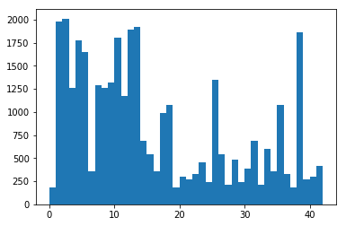


    
    Most common images
    


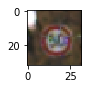


    Image Index: 31439  Label Index: 2  Class: ['Speed limit (50km/h)']


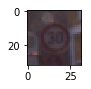


    Image Index: 2220  Label Index: 1  Class: ['Speed limit (30km/h)']


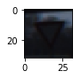


    Image Index: 21810  Label Index: 13  Class: ['Yield']


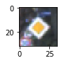


    Image Index: 27329  Label Index: 12  Class: ['Priority road']


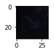


    Image Index: 14010  Label Index: 38  Class: ['Keep right']


----

## Step 2: Design and Test a Model Architecture

Design and implement a deep learning model that learns to recognize traffic signs. Train and test your model on the [German Traffic Sign Dataset](http://benchmark.ini.rub.de/?section=gtsrb&subsection=dataset).

There are various aspects to consider when thinking about this problem:

- Neural network architecture
- Play around preprocessing techniques (normalization, rgb to grayscale, etc)
- Number of examples per label (some have more than others).
- Generate fake data.

Here is an example of a [published baseline model on this problem](http://yann.lecun.com/exdb/publis/pdf/sermanet-ijcnn-11.pdf). It's not required to be familiar with the approach used in the paper but, it's good practice to try to read papers like these.

**NOTE:** The LeNet-5 implementation shown in the [classroom](https://classroom.udacity.com/nanodegrees/nd013/parts/fbf77062-5703-404e-b60c-95b78b2f3f9e/modules/6df7ae49-c61c-4bb2-a23e-6527e69209ec/lessons/601ae704-1035-4287-8b11-e2c2716217ad/concepts/d4aca031-508f-4e0b-b493-e7b706120f81) at the end of the CNN lesson is a solid starting point. You'll have to change the number of classes and possibly the preprocessing, but aside from that it's plug and play!

### Pre-process the Data Set (normalization, grayscale, etc.)

Use the code cell (or multiple code cells, if necessary) to implement the first step of your project.


```python
from sklearn.utils import shuffle
import numpy as np

#Shuffle the data
X_train, y_train = shuffle(X_train, y_train)

#Convert to grayscale
X_train = np.dot(X_train, [0.299, 0.587, 0.114])
X_valid = np.dot(X_valid, [0.299, 0.587, 0.114])
X_train = np.expand_dims(X_train, axis=3)
X_valid = np.expand_dims(X_valid, axis=3)

#Normalization
X_train = (X_train - 128.0) / 128
X_valid = (X_valid - 128.0) / 128
```

### Model Architecture


```python
from tensorflow.contrib.layers import flatten

def LeNet(x):    
    # Arguments used for tf.truncated_normal, randomly defines variables for the weights and biases for each layer
    mu = 0
    sigma = 0.1
    
    # Layer 1: Convolutional. Input = 32x32x1. Output = 28x28x6.
    Conv1_W = tf.Variable(tf.truncated_normal([5, 5, 1, 6], mean = mu, stddev = sigma))
    Conv1_b = tf.Variable(tf.zeros(6))
    strides = [1, 1, 1, 1]
    padding = 'VALID'
    conv1 = tf.nn.conv2d(x, Conv1_W, strides, padding) + Conv1_b

    # Activation.
    conv1 = tf.nn.relu(conv1)

    # Pooling. Input = 28x28x6. Output = 14x14x6.
    conv1 = tf.nn.max_pool(conv1, [1,2,2,1], [1,2,2,1], 'VALID')
    
    # Layer 2: Convolutional. Output = 10x10x16.
    Conv2_W = tf.Variable(tf.truncated_normal([5, 5, 6, 16], mean = mu, stddev = sigma))
    Conv2_b = tf.Variable(tf.zeros(16))
    strides = [1, 1, 1, 1]
    padding = 'VALID'
    conv2 = tf.nn.conv2d(conv1, Conv2_W, strides, padding) + Conv2_b
        
    # Activation.
    conv2 = tf.nn.relu(conv2)
    
    # Pooling. Input = 10x10x16. Output = 5x5x16.
    conv2 = tf.nn.max_pool(conv2, [1,2,2,1], [1,2,2,1], 'VALID')

    # Flatten. Input = 5x5x16. Output = 400.
    conv2 = tf.contrib.layers.flatten(conv2)
    
    # Layer 3: Fully Connected. Input = 400. Output = 120.
    Full_W = tf.Variable(tf.truncated_normal([400, 120], mean = mu, stddev = sigma))
    Full_b = tf.Variable(tf.zeros(120))
    full1 = tf.add(tf.matmul(conv2, Full_W), Full_b)
    
    # Activation.
    full1 = tf.nn.relu(full1)

    # Layer 4: Fully Connected. Input = 120. Output = 84.
    Full2_W = tf.Variable(tf.truncated_normal([120, 84], mean = mu, stddev = sigma))
    Full2_b = tf.Variable(tf.zeros(84))
    full2 = tf.add(tf.matmul(full1, Full2_W), Full2_b)
    
    # Activation.
    full2 = tf.nn.relu(full2)
    
    # Layer 5: Fully Connected. Input = 84. Output = 43.
    Full3_W = tf.Variable(tf.truncated_normal([84, 43], mean = mu, stddev = sigma))
    Full3_b = tf.Variable(tf.zeros(43))
    logits = tf.add(tf.matmul(full2, Full3_W), Full3_b)
    
    return logits
```

### Train, Validate and Test the Model

A validation set can be used to assess how well the model is performing. A low accuracy on the training and validation
sets imply underfitting. A high accuracy on the test set but low accuracy on the validation set implies overfitting.

### Training Pipeline


```python
import tensorflow as tf

#Define parameters
EPOCHS = 12
BATCH_SIZE = 128
LEARNING_RATE = 0.005

#Define tensors
x = tf.placeholder(tf.float32, (None, 32, 32, 1))
y = tf.placeholder(tf.int32, (None))
one_hot_y = tf.one_hot(y, 43)
logits = LeNet(x)

#Training functions
cross_entropy = tf.nn.softmax_cross_entropy_with_logits(logits, one_hot_y)
loss_operation = tf.reduce_mean(cross_entropy)
optimizer = tf.train.AdamOptimizer(learning_rate = LEARNING_RATE)
training_operation = optimizer.minimize(loss_operation)

#Evaluation functions
correct_prediction = tf.equal(tf.argmax(logits, 1), tf.argmax(one_hot_y, 1))
accuracy_operation = tf.reduce_mean(tf.cast(correct_prediction, tf.float32))
saver = tf.train.Saver()
def evaluate(X_data, y_data):
    num_examples = len(X_data)
    total_accuracy = 0
    sess = tf.get_default_session()
    for offset in range(0, num_examples, BATCH_SIZE):
        batch_x, batch_y = X_data[offset:offset+BATCH_SIZE], y_data[offset:offset+BATCH_SIZE]
        accuracy = sess.run(accuracy_operation, feed_dict={x: batch_x, y: batch_y})
        total_accuracy += (accuracy * len(batch_x))
    return total_accuracy / num_examples

```

### Training Session


```python
with tf.Session() as sess:
    sess.run(tf.global_variables_initializer())
    num_examples = len(X_train)
    
    print("Training...")
    print()
    for i in range(EPOCHS):
        X_train, y_train = shuffle(X_train, y_train)
        for offset in range(0, num_examples, BATCH_SIZE):
            end = offset + BATCH_SIZE
            batch_x, batch_y = X_train[offset:end], y_train[offset:end]
            sess.run(training_operation, feed_dict={x: batch_x, y: batch_y})
            
        validation_accuracy = evaluate(X_valid, y_valid)
        print("EPOCH {} ...".format(i+1))
        print("Validation Accuracy = {:.3f}".format(validation_accuracy))
        print()
        
    saver.save(sess, './lenet')
    print("Model saved")
```

    Training...
    
    EPOCH 1 ...
    Validation Accuracy = 0.895
    
    EPOCH 2 ...
    Validation Accuracy = 0.925
    
    EPOCH 3 ...
    Validation Accuracy = 0.911
    
    EPOCH 4 ...
    Validation Accuracy = 0.918
    
    EPOCH 5 ...
    Validation Accuracy = 0.934
    
    EPOCH 6 ...
    Validation Accuracy = 0.929
    
    EPOCH 7 ...
    Validation Accuracy = 0.909
    
    EPOCH 8 ...
    Validation Accuracy = 0.930
    
    EPOCH 9 ...
    Validation Accuracy = 0.890
    
    EPOCH 10 ...
    Validation Accuracy = 0.932
    
    EPOCH 11 ...
    Validation Accuracy = 0.935
    
    EPOCH 12 ...
    Validation Accuracy = 0.909
    
    Model saved


```python
#Test data preprocessing
X_test = np.dot(X_test, [0.299, 0.587, 0.114])
X_test = np.expand_dims(X_test, axis=3)
X_test = (X_test - 128.0) / 128

```


```python
#test data accuracy
with tf.Session() as sess:
    saver.restore(sess, tf.train.latest_checkpoint('.'))
    test_accuracy = evaluate(X_test, y_test)
    print("Test Accuracy = {:.3f}".format(test_accuracy))
    print()
```

    Test Accuracy = 0.893
    


---

## Step 3: Test a Model on New Images

To give yourself more insight into how your model is working, download at least five pictures of German traffic signs from the web and use your model to predict the traffic sign type.

You may find `signnames.csv` useful as it contains mappings from the class id (integer) to the actual sign name.

### Load and Output the Images


```python
import cv2
import matplotlib.pyplot as plt
import numpy as np

my_x = []
my_y = []

#images found on thw web
web_imgs = ['web_test_1_no_passing.png',
            'web_test_2_road_work.png',
            'web_test_3_ahead_only.png',
            'web_test_4_general_caution.png',
            'web_test_5_priority_road.png']

my_y = [9,25,35,18,12]
# 9  = no passing
# 25 = road work
# 35 = ahead only
# 18 = general_caution
# 12 = priority road

for img_name in web_imgs:
    #load the image
    img = cv2.imread(img_name)
    
    #convert to grayscale
    img = np.dot(img, [0.299, 0.587, 0.114])
    img = np.expand_dims(img, axis=2)
    image = img.squeeze()
    plt.figure(figsize=(1,1))
    plt.imshow(image, cmap="gray")
    plt.show()

    #normilize
    img = (img - 128.0) / 128
    
    #append to list of inputs
    my_x.append(img)
    my_y.append

#images from the training set    
'''
my_x.append(X_train[2220])
my_x.append(X_train[31439])
my_x.append(X_train[21810])
my_x.append(X_train[27329])
my_x.append(X_train[14010])

my_y.append(y_train[2220])
my_y.append(y_train[31439])
my_y.append(y_train[21810])
my_y.append(y_train[27329])
my_y.append(y_train[14010])
'''

my_x = np.array(my_x)

print(my_x.shape)


```


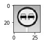


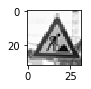


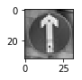


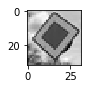


    (5, 32, 32, 1)


### Predictions and Performance


```python
import matplotlib.pyplot as plt
import pprint
import tensorflow as tf
pp = pprint.PrettyPrinter(indent=4)


with tf.Session() as sess:
    saver.restore(sess, tf.train.latest_checkpoint('.'))
    softmax = tf.nn.softmax(logits)
    result = sess.run(softmax, feed_dict={x: my_x})
    values, indices = tf.nn.top_k(result, 5)
    probs = sess.run(values)
    predictions = sess.run(indices)

#loop results and output image plus prediction
imgIndex = 0
correctCtr = 0
for prediction in predictions:
    #Output the corresponding image
    image = my_x[imgIndex].squeeze()
    plt.figure(figsize=(1,1))
    plt.imshow(image, cmap="gray")
    plt.show()
    #display labels predicted
    labels = []
    valueIndex = 0
    for index in prediction:
        labels.append(class_labels[index])
        print(class_labels[index], " [Prob:", probs[imgIndex][valueIndex],"]")
        valueIndex = valueIndex + 1
    #print(labels)
    #pp.pprint(labels)    
    if(prediction[0] == my_y[imgIndex]):
        print("Prediction Correct: ", class_labels[my_y[imgIndex]])
        correctCtr = correctCtr + 1
    else:
        print("Prediction Incorrect. ",class_labels[my_y[imgIndex]], " expected")
    imgIndex = imgIndex + 1

print()
print("====================")
print("Accuracy: ", (correctCtr / len(my_x)))
```


    ['No entry']  [Prob: 0.998446 ]
    ['No passing']  [Prob: 0.00154156 ]
    ['Stop']  [Prob: 1.04053e-05 ]
    ['Priority road']  [Prob: 1.41684e-06 ]
    ['Speed limit (70km/h)']  [Prob: 2.63112e-07 ]
    Prediction Incorrect.  ['No passing']  expected


    ['Road work']  [Prob: 0.999999 ]
    ['Slippery road']  [Prob: 1.39008e-06 ]
    ['Beware of ice/snow']  [Prob: 2.45338e-09 ]
    ['Bumpy road']  [Prob: 1.12639e-17 ]
    ['Double curve']  [Prob: 4.03516e-18 ]
    Prediction Correct:  ['Road work']


    ['Ahead only']  [Prob: 0.975597 ]
    ['Go straight or right']  [Prob: 0.0244031 ]
    ['Priority road']  [Prob: 1.02313e-09 ]
    ['No passing']  [Prob: 3.12671e-10 ]
    ['Dangerous curve to the right']  [Prob: 1.04374e-11 ]
    Prediction Correct:  ['Ahead only']


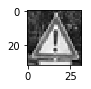


    ['General caution']  [Prob: 1.0 ]
    ['Pedestrians']  [Prob: 1.33341e-09 ]
    ['Right-of-way at the next intersection']  [Prob: 3.89505e-10 ]
    ['Dangerous curve to the right']  [Prob: 3.78361e-19 ]
    ['Children crossing']  [Prob: 1.08287e-22 ]
    Prediction Correct:  ['General caution']


    ['Priority road']  [Prob: 1.0 ]
    ['Right-of-way at the next intersection']  [Prob: 1.6998e-31 ]
    ['Roundabout mandatory']  [Prob: 8.21256e-34 ]
    ['No entry']  [Prob: 2.20861e-34 ]
    ['Ahead only']  [Prob: 1.69672e-34 ]
    Prediction Correct:  ['Priority road']
    
    ====================
    Accuracy:  0.8


> **Note**: Once you have completed all of the code implementations, you need to finalize your work by exporting the IPython Notebook as an HTML document. Before exporting the notebook to html, all of the code cells need to have been run. You can then export the notebook by using the menu above and navigating to  \n",
    "**File -> Download as -> HTML (.html)**. Include the finished document along with this notebook as your submission. 

### Project Writeup

Once you have completed the code implementation, document your results in a project writeup using this [template](https://github.com/udacity/CarND-Traffic-Sign-Classifier-Project/blob/master/writeup_template.md) as a guide. The writeup can be in a markdown or pdf file. 
